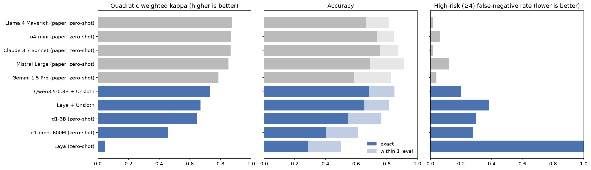
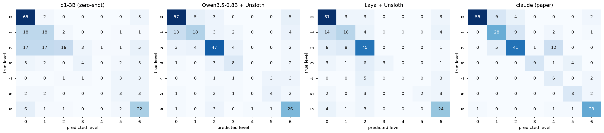
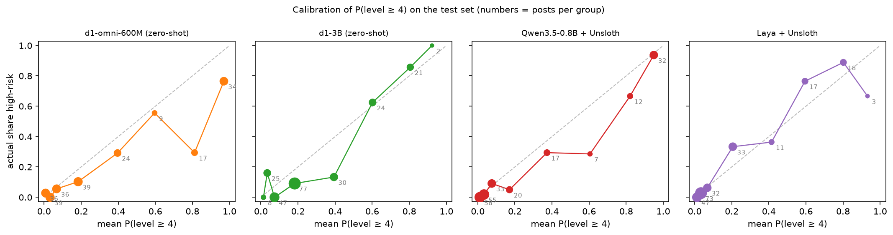

[](https://colab.research.google.com/github/CJosh88/slms/blob/main/experiments/2026-10-decision-models-cssrs/notebook.ipynb)
[Code and data on GitHub](https://github.com/CJosh88/slms/tree/main/experiments/2026-10-decision-models-cssrs)

::: {.callout-warning appearance="simple"}
## Content note and scope

The dataset is real Reddit posts describing suicidal thoughts. This experiment measures how well models agree with human labels on a published research benchmark. It is **not** a screening tool, and none of these models should be used to assess real people. No posts are quoted here.

If you're struggling, please reach out to someone you trust or a local crisis line.
:::

::: {.callout-note appearance="simple"}
## TL;DR

- **Fine-tuning beat the off-the-shelf decision model.** Qwen3.5-0.8B, fine-tuned into a decision model with Unsloth on 819 posts, reached 68.4% exact accuracy against 54.7% for zero-shot d1-3B (p = 0.0003).
- **Same accuracy, 10× the misses.** It was level with Llama 4 Maverick on exact accuracy (68.4% vs 66.5%, p = 0.76), but at its default threshold it missed 10 of the 50 high-risk posts. Llama 4 Maverick missed 1 (p = 0.004).
- **A sensible threshold closes most of the gap.** With thresholds chosen on held-out calibration data, the fine-tuned models caught 45–46 of 50 high-risk posts while flagging 69–88. Claude 3.7 Sonnet caught 49 while flagging 71, and Llama 4 Maverick caught 49 while flagging 86.
- **The last few high-risk posts are the expensive ones.** The models rate them as almost certainly not high risk, so catching them means flagging nearly everything. The probabilities themselves are reasonably calibrated.
- **Zero-shot Laya couldn't use the 7-level scale.** It put 221 of 234 posts at level 2. Three minutes of fine-tuning took it from 28.6% to 65.4%.
:::

## The question

"System-1" decision models answer a typed question (yes/no, pick one option, or a rating) in a single forward pass, with calibrated probabilities and no generated text. Two releases made them easy to try this month:

- **[LiquidAI d1](https://huggingface.co/blog/LiquidAI/open-d1)** (7 October 2026) is a pair of open, off-the-shelf models: d1-3B and the experimental d1-omni-600M.
- **[Unsloth 2026.10](https://unsloth.ai/docs/basics/train-your-own-decision-model-with-unsloth)** can fine-tune any LLM into a decision model, or further fine-tune an existing one such as Laya.

I wanted to know how they do on a sensitive, ordinal task where errors aren't equal: grading suicide risk on the Columbia Suicide Severity Rating Scale (C-SSRS, levels 0–6). In triage, missing a high-risk case costs far more than a false alarm, so the question is both "how accurate?" and "how many high-risk posts does it miss?"

## Why test small models on this at all?

A fair objection: why would anyone put a small single-pass model anywhere near a task this serious, rather than a large model that works through its answer?

The only role I'd consider is **first-pass prioritisation under human review**. That means ranking a queue so people see the riskiest posts first, never deciding anyone's care. In that role, small decision models have real advantages:

- **Privacy.** Mental-health text often can't be sent to a third-party API. A 0.4–0.8B model runs locally on about 1 GB of GPU memory.
- **Cost and speed.** Busy queues can see thousands of posts a day. These models took 20–200 ms per post on a free T4, with no API calls.
- **A tunable operating point.** They return a probability, so you can choose how sensitive to be on held-out data. The frontier labels here are single labels with no such dial.

This also isn't a clean reasoning-versus-non-reasoning comparison. In the paper's code, only o4-mini is a dedicated reasoning model. Claude 3.7 Sonnet was called without extended thinking, and Llama 4 Maverick, Mistral Large and Gemini 1.5 Pro are standard generative models. What they share is a prompt asking for a written rationale for each of the six C-SSRS questions before the score. The dedicated reasoning model wasn't the best at catching high-risk posts either: o4-mini missed 3, while Claude 3.7 Sonnet and Llama 4 Maverick missed 1 each. The real comparison is **small single-pass models against large models that write out their assessment**.

The results end up supporting the caution behind the objection. Even at a sensible threshold, the small models missed a few more high-risk posts than the best large models. If they're used at all, a person should review their output.

## How a decision model answers

A normal LLM predicts the next word over its whole vocabulary, so you generate text and parse a level out of it. A decision model removes that word-predicting head. The LLM reads the post, the question and every answer option together, and a small head scores each option directly.

```{mermaid}
%%| fig-cap: "Same backbone, two ways of getting a C-SSRS level out of it."
flowchart TB
  subgraph G["Generative LLM"]
    direction LR
    A["Prompt: post +<br/>scale description"] --> B["LLM"] --> C["Generate tokens<br/>'severity: 4'"] --> D["Parse a level"]
  end
  subgraph S["Decision model"]
    direction LR
    E["Post + question +<br/>7 level descriptions"] --> F["LLM reads once<br/>(no generation)"] --> H["Decision head scores<br/>each level"] --> I["P(level 0) … P(level 6)"]
  end
  G ~~~ S
```

Unsloth's head follows the design of Cloudflare's Clef. It pools the LLM's hidden states over the question and each option, lets each option attend back over the post, and scores every option. A temperature fitted on held-out data then calibrates the probabilities. When you start from a plain LLM such as Qwen, the head starts untrained, so there is no meaningful zero-shot result for it.

## Setup

| | |
|---|---|
| **Data** | [`av9ash/CSSR-S_labelled_suicidewatch_posts_reddit`](https://huggingface.co/datasets/av9ash/CSSR-S_labelled_suicidewatch_posts_reddit) (CC BY 4.0): 1,170 r/SuicideWatch posts with human C-SSRS labels (0–6) |
| **Splits** | Stratified, seed 42: 819 train, 117 calibration, 234 test (50 high-risk, level ≥ 4) |
| **Question** | Identical for every decision model: a 7-level `score` question with one description per C-SSRS level |
| **Zero-shot** | Laya (421M), d1-omni-600M, d1-3B |
| **Fine-tuned with Unsloth 2026.10.3** | Qwen3.5-0.8B with a new decision head (4-bit QLoRA, r = 16, 3 epochs) and Laya (LoRA, r = 16, 3 epochs), both calibrated on the 117 calibration posts |
| **Reference** | Zero-shot labels published with the dataset ([Patil et al., 2025](https://arxiv.org/abs/2505.13480)) from o4-mini, Claude 3.7 Sonnet, Gemini 1.5 Pro, Llama 4 Maverick and Mistral Large, each prompted to write a rationale for every C-SSRS question before giving a score |
| **Hardware** | One free Colab T4 |

## Results

All numbers are on the 234 test posts. The frontier LLM rows are scored on the posts each model labelled (233 or 234).

| Model | Exact acc. | 95% CI | Within 1 level | QWK | High-risk caught (P ≥ 0.5) | ECE | ms / post | Peak GPU |
|---|---|---|---|---|---|---|---|---|
| Majority class (always 0) | 29.9% | 24.4–36.1% | 47.0% | 0.00 | 0 / 50 | | | |
| Laya (zero-shot) | 28.6% | 23.2–34.7% | 50.0% | 0.05 | 0 / 50 | 0.200 | 73 | 2.4 GB |
| d1-omni-600M (zero-shot) | 40.6% | 34.5–47.0% | 61.1% | 0.46 | 36 / 50 | 0.336 | **20** | 1.2 GB |
| d1-3B (zero-shot) | 54.7% | 48.3–61.0% | 76.5% | 0.65 | 35 / 50 | 0.048 | 116 | 6.3 GB |
| Laya + Unsloth | 65.4% | 59.1–71.2% | 81.6% | 0.67 | 31 / 50 | **0.045** | 56 | **1.0 GB** |
| **Qwen3.5-0.8B + Unsloth** | **68.4%** | 62.2–74.0% | **85.0%** | **0.73** | **40 / 50** | 0.056 | 198 | 1.4 GB |
| o4-mini | 73.8% | 67.8–79.0% | 84.5% | 0.87 | 46 / 49 | | | |
| Claude 3.7 Sonnet | 75.5% | 69.6–80.6% | 87.6% | 0.87 | 49 / 50 | | | |
| Gemini 1.5 Pro | 58.5% | 52.1–64.7% | 82.9% | 0.79 | 48 / 50 | | | |
| Llama 4 Maverick | 66.5% | 60.2–72.3% | 81.5% | 0.88 | 49 / 50 | | | |
| Mistral Large | 69.2% | 63.0–74.8% | 91.5% | 0.85 | 44 / 50 | | | |

QWK (quadratic weighted kappa) measures agreement on the ordinal scale, penalising big misses more than near misses. ECE is the expected calibration error of each model's top-level probability. Bold marks the best decision model in each column. Fine-tuning took 20.5 minutes for Qwen and 3.0 minutes for Laya.



### Fine-tuning beat the off-the-shelf model

With 819 training posts, the fine-tuned Qwen got 53 test posts exactly right that d1-3B got wrong, against 21 the other way (exact McNemar p = 0.0003). Fine-tuned Laya also beat d1-3B (p = 0.004). The two fine-tuned models weren't significantly different from each other (p = 0.42).

### Same accuracy, 10× the misses

On exact accuracy, the fine-tuned Qwen is level with Llama 4 Maverick (68.4% vs 66.5%, p = 0.76) and Mistral Large (69.2%, p = 0.91). On the 50 high-risk posts it is not:

| Compared with | High-risk posts it caught that Qwen missed | Qwen caught that it missed | p |
|---|---|---|---|
| Llama 4 Maverick | 9 | 0 | 0.004 |
| Claude 3.7 Sonnet | 10 | 1 | 0.01 |
| Gemini 1.5 Pro | 9 | 1 | 0.02 |
| o4-mini | 9 | 2 | 0.07 |

The frontier models also have higher QWK (0.85–0.88 against 0.73), so when they're wrong, they're wrong by less. Several of Qwen's misses were large: level-5 and level-6 posts rated 0 or 2.



### Can a better threshold fix it?

A decision model flags a post as high risk when P(level ≥ 4) passes a threshold, and 0.5 is arbitrary. A triage system would choose a threshold that hits a target sensitivity. To keep the test set clean, the rule was fixed in advance: take the highest threshold that catches at least the target share of the 25 high-risk posts in the calibration split, then apply it unchanged to the test set. I report two targets, 90% (23 of 25) and 95% (24 of 25).

| Model | Target | Threshold | High-risk caught | Posts flagged | Specificity | Precision |
|---|---|---|---|---|---|---|
| d1-omni-600M (zero-shot) | 90% | 0.16 | 47 / 50 | 106 | 68% | 44% |
| | 95% | 0.09 | 47 / 50 | 126 | 57% | 37% |
| d1-3B (zero-shot) | 90% | 0.21 | 44 / 50 | 103 | 68% | 43% |
| | 95% | 0.14 | 46 / 50 | 131 | 54% | 35% |
| Laya + Unsloth | 90% | 0.20 | 45 / 50 | **69** | **87%** | **65%** |
| | 95% | 0.07 | 46 / 50 | 98 | 72% | 47% |
| Qwen3.5-0.8B + Unsloth | 90% | 0.10 | 46 / 50 | 88 | 77% | 52% |
| | 95% | 0.03 | 50 / 50 | 160 | 40% | 31% |
| o4-mini | label | | 46 / 49 | 74 | 85% | 62% |
| Claude 3.7 Sonnet | label | | 49 / 50 | 71 | 88% | 69% |
| Gemini 1.5 Pro | label | | 48 / 50 | 77 | 84% | 62% |
| Llama 4 Maverick | label | | 49 / 50 | 86 | 80% | 57% |
| Mistral Large | label | | 44 / 50 | 55 | 94% | 80% |

Zero-shot Laya is left out of this table: it needs a threshold of about 0.17 and flags 180–191 posts. All its rows are in [`thresholds.csv`](thresholds.csv).

**A threshold chosen for 90% sensitivity closes most of the gap.** Fine-tuned Laya caught 45 of 50 while flagging 69, and fine-tuned Qwen caught 46 while flagging 88. That's close to Claude 3.7 Sonnet (49 caught, 71 flagged) and Llama 4 Maverick (49 caught, 86 flagged). The remaining gap is 3–4 high-risk posts.

**The last few posts are the expensive ones.** The 95% target means catching 24 of 25 calibration posts, so the threshold is set by the second-hardest one. For Qwen, the three hardest high-risk calibration posts got P(level ≥ 4) of 0.020, 0.028 and 0.10. Moving from a 90% to a 95% target drops its threshold from 0.10 to 0.03. It then catches all 50 test posts, but flags 160 of 234. One post decided that.


The frontier models over-flag too. They flag 55–86 posts for 50 true high-risk ones, with precision between 57% and 80%.

### Is a threshold of 0.03 a sign the model is miscalibrated?

Mostly not. Grouping test posts by P(level ≥ 4) and checking how many are really high risk shows the low end is honest:

| Qwen3.5-0.8B + Unsloth P(level ≥ 4) | Posts | Actually high-risk |
|---|---|---|
| 0.00–0.02 | 58 | 0% |
| 0.02–0.05 | 55 | 2% |
| 0.05–0.10 | 33 | 9% |
| 0.10–0.30 | 20 | 5% |
| 0.30–0.90 | 36 | 42% |
| 0.90–1.00 | 32 | 94% |

When Qwen says "about 3%", about 2% of those posts are high risk. A threshold of 0.03 is simply what it takes to include the few high-risk posts the model is confidently wrong about. Qwen does run hot in the middle range: posts it puts at 0.3–0.9 are high risk only about 40% of the time. Fine-tuned Laya leans the other way, slightly underconfident in the middle, and d1-3B tracks the diagonal well above 0.5. d1-omni-600M is the least calibrated: posts it puts above 0.9 are high risk only 76% of the time.



### What else stood out

- **Zero-shot Laya collapsed to one level.** It put 221 of 234 posts at level 2 and scored below always guessing 0. A 7-level ordinal scale seems to be outside what it learned to do zero-shot, but three minutes of fine-tuning fixed most of it.
- **d1-3B is well calibrated but conservative.** Its ECE is 0.048, the confidence scores mean something, and it predicted level 0 for 111 posts when 70 are truly level 0. Seven of its high-risk misses were level-6 posts it rated 0 or 1.
- **d1-omni-600M is fast but poorly calibrated.** It took 20 ms per post, but its ECE is 0.34.
- **Small models are cheap but not always fast.** Every Qwen prediction runs the full 0.8B model over the post plus all 7 level descriptions, in 4-bit on a T4, which took 198 ms against 56 ms for fine-tuned Laya.

## What I take from this

1. **A few hundred labelled examples beat an off-the-shelf decision model on this task.** Unsloth made that a 20-minute job on a free GPU.
2. **Exact accuracy hid the difference that matters.** A model can be level on accuracy and still miss many more of the cases you care about most. For triage-style tasks, report sensitivity on the high-risk class alongside accuracy, and choose the threshold on held-out data.
3. **Choose the threshold on held-out data, and be wary of tail targets on small samples.** A threshold chosen for 90% sensitivity closed most of the gap. A 95% target, set by the second-hardest of 25 calibration posts, swung the threshold for one model from 0.10 to 0.03. The last few cases are the expensive ones, and the frontier models still have the better trade-off there.
4. **Calibration varies a lot between decision models.** d1-3B and the fine-tuned models had low ECE, while d1-omni-600M and zero-shot Laya didn't. That matters if you plan to act on the probabilities.

## Limitations

- **One split, small test set.** There are 234 test posts with 50 high-risk, so intervals are wide: Qwen's 80% high-risk sensitivity has a 95% CI of 67–89%. The calibration split has only 25 high-risk posts, which makes thresholds for high sensitivity targets unstable.
- **Run-to-run variation.** An earlier run of the same notebook gave the fine-tuned Qwen 72.2% accuracy and 9 high-risk misses. Treat differences of a few points between the fine-tuned models as noise.
- **Not like-for-like.** The fine-tuned models saw 819 in-domain posts. The frontier labels come from the paper's own zero-shot prompt, not the question used here.
- **The level descriptions are inputs.** Each decision model reads the 7 level descriptions, so rewording them could change results.
- **One source, one month.** All posts are from r/SuicideWatch in December 2024, labelled by one annotation process.
- **Latency** is one post per call on a T4. Qwen's includes 4-bit overhead.

## Data and reproducibility

| Dataset | Source | Licence |
|---|---|---|
| C-SSRS-labelled r/SuicideWatch posts | [Hugging Face](https://huggingface.co/datasets/av9ash/CSSR-S_labelled_suicidewatch_posts_reddit) · [paper code](https://github.com/av9ash/llm_cssrs_code) | CC BY 4.0 |

A. Patil, S. Tao and A. Gedhu (2025), *Evaluating Reasoning LLMs for Suicide Screening with the Columbia-Suicide Severity Rating Scale*, [arXiv:2505.13480](https://arxiv.org/abs/2505.13480). The frontier model versions are as named in the paper's assessment code.

The notebook runs top to bottom on a free Colab T4 with the [Open in Colab](https://colab.research.google.com/github/CJosh88/slms/blob/main/experiments/2026-10-decision-models-cssrs/notebook.ipynb) button, with pinned versions: Unsloth 2026.10.3, Laya 0.4.1, transformers 5.17.0. The per-post predicted levels (no post text) and all result tables are [on GitHub](https://github.com/CJosh88/slms/tree/main/experiments/2026-10-decision-models-cssrs).
